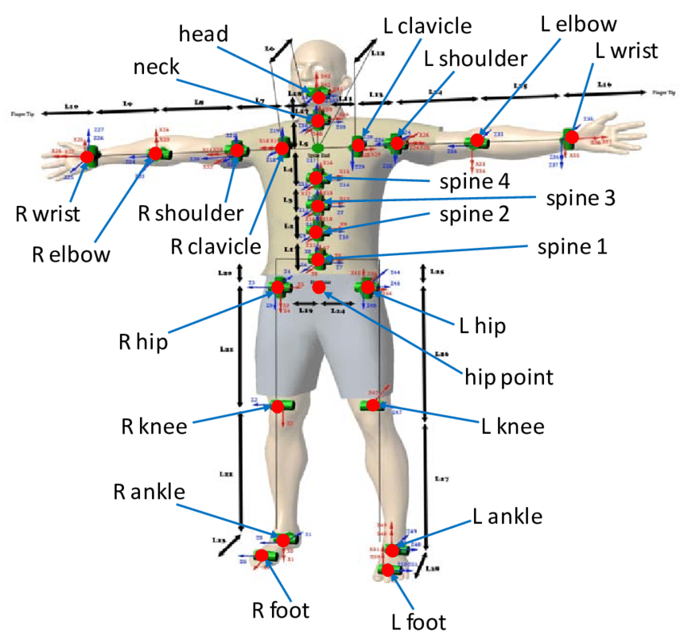
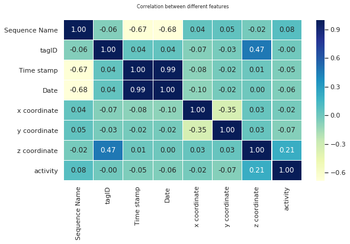
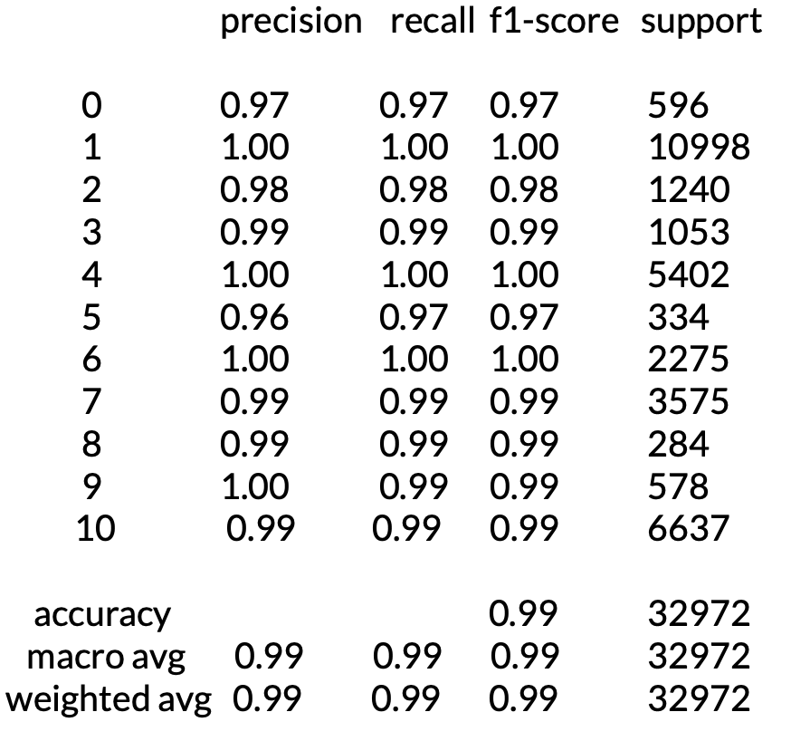
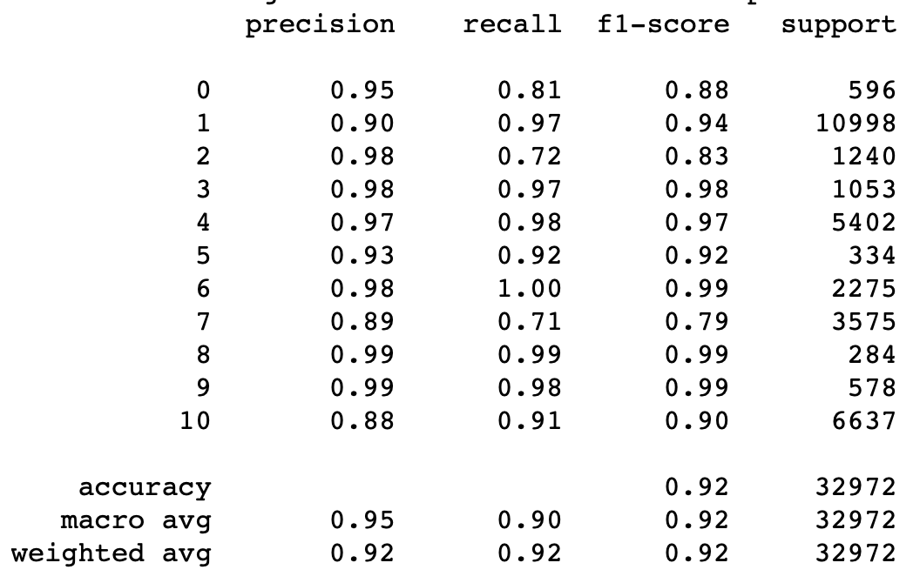
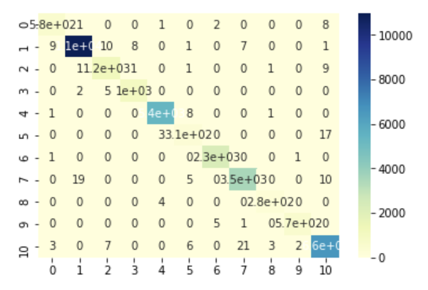
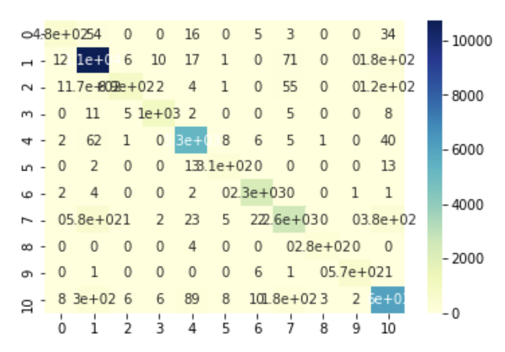
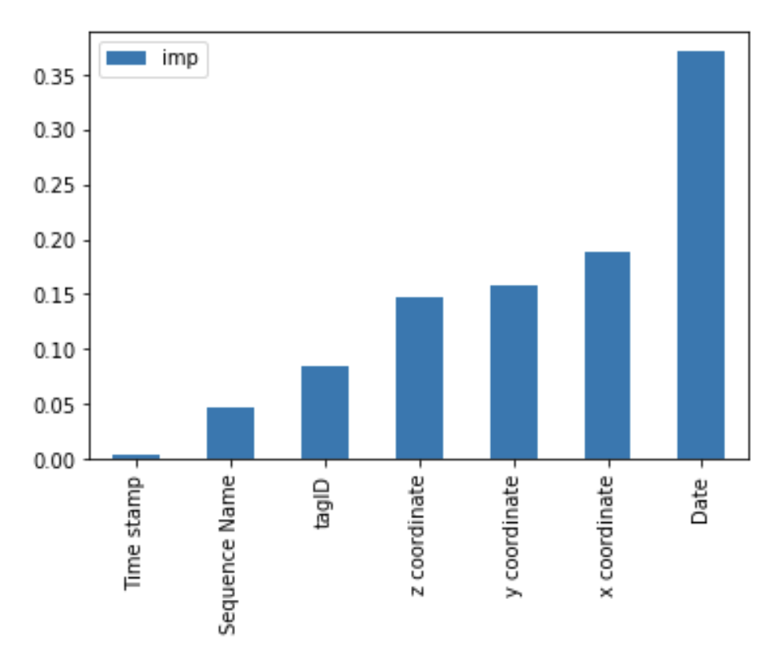

# Reconstructing-Posture-with-ML-and-DL

Posture Reconstruction   |  
:-------------------------:|
 |

This exploration takes a gander at different strategies for the arrangement of univariate pose reproduction information. The dataset utilized is openly accessible on Kaggle. We have attempted to change over the issue of characterizing time arrangement information into a standard order issue.

---
## Outline

1. [Introduction](#introduction)
2. [Literature Survey](#literature-survey)
3. [Dataset](#dataset)
   * [Data Preparation and Preprocessing](#data-preparation-and-preprocessing)
4. [Methodology](#methodology)
   * [Classification Techniques](#classification-techniques)
   * [Evaluation](#evaluation)
5. [Results and Analysis](#results-and-analysis)
6. [Conclusions](#conclusions)
7. [References](#references)

---

### Introduction
Time series sequences are regularly experienced in classification and regression tasks today. A few instances of time-series information incorporate an expectation of stock costs, climate forecast, deals expectation. Time-series are partitioned into two classes. Univariate time arrangement information relies upon a solitary variable, while multivariate information has two autonomous factors. The univariate problem is by and large utilized to predict the following number in the sequence, though multivariate information is basically utilized for a classification task. The objective is to utilize univariate information for the prediction task. The dataset picked is posture reconstruction that incorporates information about the situating of different sensors around the body. The classification issue at hand is recognising an individual's posture utilizing data from these sensors at a specific time. The proposed strategy for this errand is utilising a K-NN classifier with k=1(Number of neighbours). This strategy accomplishes a precision of 99.6%, which is equivalent to the precision accomplished by other best in class models that are considerably more perplexing.

### Literature Survey
* The paper called Classification of posture reconstruction was presented in 2018 internatinal conference on SIET. The paper proposed the application of KNN for the problem due to its simplicity.
* The data is initially fed to the model. The following step is to determine the closest sequence based on the time-stamps. After we get the successive value for the data, we compute the distance to every neighbour using the euclidean distance. Then we vote the class category based on k value and then we rank the resultant from the nearest neighbour to the most farthest neighbour.
* There are two rules in classifying the new unlabeled data. Those are majority voting based on k value and similarity score summing. The class or category gets one vote for each instance of that class in the neighborhood sample set k. Next is that the new data samples are classified into the class with the largest number of votes. In similarity scores summing,each class gets indistinguishable score from the summation of the comparability level of the class instance in the environmental sample set. Then, the sample of new
data is classified into the class with the highest degree of the similarity.
* The authors determined that the number of k should be five based on similarity measurement by Euclidean distance. They have used a time series column for calculating the
nearest neighbors. They achieved an accuracy of .995 using this technique.
* The research also still could’t measure how high the accuracy degree of the k-NN in classification of posture reconstruction. But regardless of the accuracy degree, k-NN is declared to be able to solve uni variate time series classification.

### Dataset
The dataset has 164860 instances, and eight attributes (including the output class). Thus, there are 7 features:
1. Sequence Name A01, A02, A03, A04, A05, B01, B02, B03, B04, B05, C01, C02, C03, C04, C05, D01, D02, D03, D04, D05, E01, E02, E03, E04, E05 (Nominal) - A, B, C, D, E = 5 people.
2. Tag identificator 010-000-024-033,020-000-033-111,020-00 0-032-221,010-000-030-096 (Nominal) - ANKLE LEFT = 010-000-024-033 - ANKLE RIGHT = 010-000-030-096 - CHEST = 020-000-033-111 - BELT = 020-000-032-221
3. Timestamp (Numeric) – All unique
4. Date FORMAT = dd.MM.yyyy HH:mm:ss:SSS (Date)
5. X coordinate of the tag (Numeric) f) Y coordinate of the tag (Numeric)
6. Z coordinate of the tag (Numeric)  

The number of output classes is 11, which are as follows:  
Walking, falling, lying down, lying, sitting down, sitting, standing up from lying, on all fours, sitting on the ground, standing up from sitting, standing up from sitting on the ground.

[Link to Dataset](https://www.kaggle.com/uciml/posture-reconstruction)

Confusion Matrix   |  
:-------------------------:|
 |

#### Data Preparation and Preprocessing
* The dataset contains many categorical fields like Date, sequence name, Tag identifier. Label encoders are employed to convert these fields into numerical values and then applied normalization.
* The dataset is complete, and there are no missing values in it.
* First, the features of the dataset were encoded, which do not have a numerical value, and are considered as objects by numpy.
* As a result, the features: Sequence Name, TagID and Date were converted into numerical values. In addition to this, the output field was encoded too.
* To normalize each column, the data was mapped from [-1,1] by subtracting mean and dividing by standard deviation.
* Correlation was used to determine if two or more classes collide with each other. Based on this, it can be seen that no two classes collide with each other. Also, the conclusion
can be drawn that the Z coordinate is the most co-related feature for the label activity. 
* In the confusion matrix, the timestamp feature has very low value for the activity. This can also be confirmed by the feature importance chart generated later. Thus for the context of this project, timestamp was omitted.
* Date came out to be the most important feature.
* Z-score was used to treat outliers. Further to reduce the effect of outliers, RMSLE methods were used to calculate error.

### Methodology

#### Classification Techniques
The project utilizes different classification procedures that model the time-series information as a standard classification problem by either by normalizing the date variable or by out and out dropping it. Dropping the date variable doesn't have a lot of impact on K-NN, yet it diminishes the exactness of different models. The classification algorithms utilized incorporate SVM, Logistic Regression, Random Forests, Decision Trees, Ridge and Lasso, K-NN, MLP, ElasticNet, Gradient Boosting Classifier.

#### Evaluation
To generate the statistics showing the precision, recall and F1 score, we have used the classification report function of SKlearn. In addition to the above mentioned evaluation metrics, confusion matrices were generated to get an idea about the performance of the model. In a confusion matrix, the entry at position (i, j) represents the number of samples which were actually belonging to class ”i”, but were predicted to be in class ”j” by our model. Generally, if a model performs well, the diagonal entries of it’s confusion matrix would have relatively higher values than the rest of the entries. ROC curves have also been printed to identify the prediction of an algorithm for different classes. The ROC curve tells us how much the model is capable of differentiating between the classes.

### Results and Analysis
Accuracies of different models
|Model | Accuracy|
|----|-----|
|Gradient Boosting| 92.1%|
|Random Forest | 92%|
|Decision Trees| 85%|
|KNN|99.44%|
|MLP|77.19%|
|Logistic Regression|41%|
|SGD Classifier| 28.99%|

Classification Report for K-NN|  Classification Report for Gradient Boosting|  
:-------------------------:|:-------------------------:|
 |  |

Confusion Matrix for K-NN|  Confusion Matrix for Gradient Boosting|  
:-------------------------:|:-------------------------:|
 | |

ROC curve for K-NN|  Feature Importance| 
:-------------------------:|:-------------------------:|
 | |

### Conclusions
* Gradient boosting gave an accuracy of 92.1% which is decent enough. But the problem with Gradient boosting is that it overfits very quickly. The default iterations were 100. Increasing the iterations to 500 resulted in training accuracy of 98.5% while the testing accuracy decreased sharply.
* Based on the results, we conclude that K-NN is the best algorithm for this problem. In this case, we used k=5.
* We can, therefore, infer that the K-NN classifier can be used for uni-variate time series problems, even without account for the time-series nature of the data, to achieve high accuracy.
### References
1. [Rikatsih, N., Supianto, A.A. (2018). Classification of Posture Reconstruction with Univariate Time Series Data Type, 2018 International Conference on Sustainable Information Engineering and Technology (SIET), 322-325.](https://ieeexplore.ieee.org/abstract/document/8693174)
